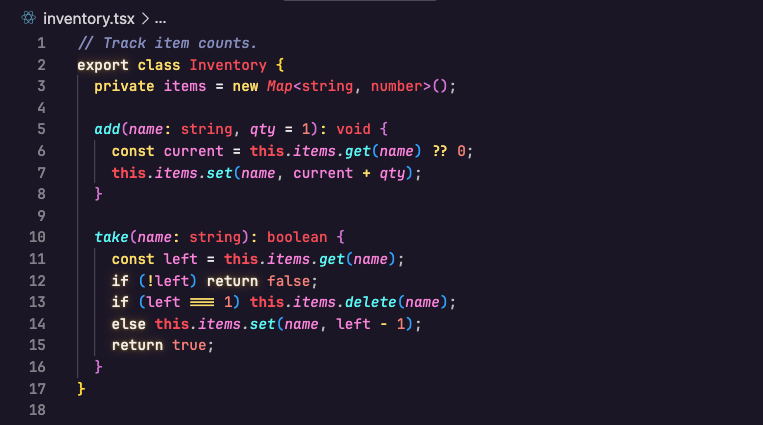
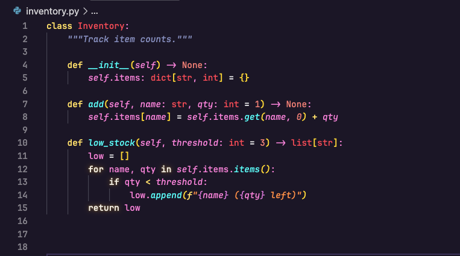
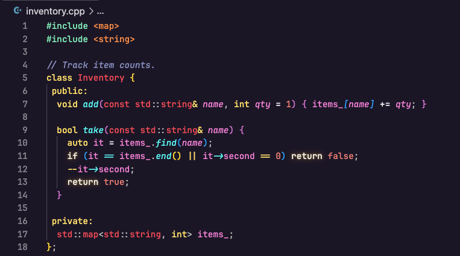
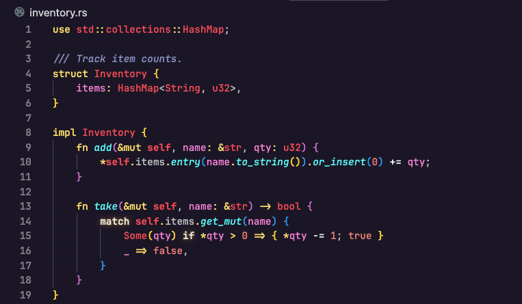
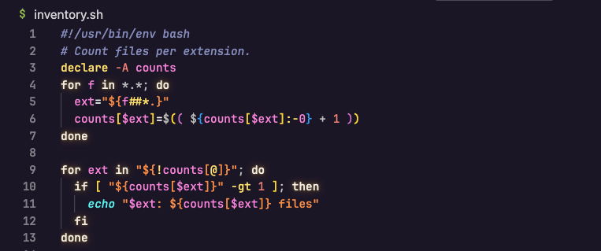

# Glowing SynthWave '84

A personal fork of [SynthWave '84](https://marketplace.visualstudio.com/items?itemName=RobbOwen.synthwave-vscode)
by Robb Owen: darker background, italic function names, and a glow limited to
control-flow keywords.

Not on the Marketplace — grab the prebuilt `.vsix` from the releases, or build from source.

## What's different

### TypeScript



### Python



### C++



### Rust



### Shell



Backgrounds are darker than stock (`#262335` -> `#1B1626`, with the other
surfaces shifted by the same ratio). Function and method names are italic.
Syntax colours are otherwise untouched.

Italics are set through both `tokenColors` and `semanticTokenColors` — the
theme enables `semanticHighlighting`, so the semantic layer overrides
TextMate scopes in TypeScript and Python.

### Font

Use a font with a true italic, or the italics render as a synthesised slant.
Developed against [JetBrains Mono](https://www.jetbrains.com/lp/mono/), or
its [Nerd Font build](https://www.nerdfonts.com/font-downloads) if you want
the extra glyphs for file icons and terminal prompts.

```json
"editor.fontFamily": "JetBrainsMono Nerd Font",
"editor.fontLigatures": true
```

## Light variant

The extension also ships **SynthWave Sunrise** — a pastel sibling, not
"SynthWave in light mode": no neon survives a light ground, so the hues are
darkened until they read on pale pink-lavender. The glow is dark-only.

## Install

Download the prebuilt `.vsix` from the [latest release](https://github.com/NLykoskoufis/glowing-synthwave-84/releases/latest), then either:

- VS Code → Extensions panel → `⋯` menu → **Install from VSIX…**, or
- `code --install-extension <downloaded-file>.vsix`

### From source

Requires Node.js. From the repo root:

```bash
npx @vscode/vsce package --allow-missing-repository --skip-license --out /tmp/glowing-synthwave-84.vsix
code --install-extension /tmp/glowing-synthwave-84.vsix
```

Reload the window, then pick **Glowing SynthWave '84** via `Cmd+K Cmd+T` (macOS) or `Ctrl+K Ctrl+T` (Windows/Linux).

Copying the folder into `~/.vscode/extensions/` does **not** work — VS Code
only loads extensions listed in `extensions.json`, which the installer
writes. When rebuilding, bump `version` in `package.json` first, or the
reinstall is silently skipped.

## Glow (optional)

Themes can't express `text-shadow`, so a script rewrites VS Code's generated
token stylesheet. It matches on **hex value** rather than Monaco's `.mtkN`
classes, whose indices shift when theme colours are reordered. That makes it
selective: `keyword.control` gets a dedicated `#fede5c` — visually identical
to the `#fede5d` keyword yellow — and only that hex is mapped. To light up
another group, give it a unique hex and add it to
`glow/synthwave-custom-glow.js`.

1. Install [Custom CSS and JS Loader](https://marketplace.visualstudio.com/items?itemName=be5invis.vscode-custom-css).
2. Add to your user `settings.json`:

   ```json
   "vscode_custom_css.imports": [
     "file:///absolute/path/to/glowing-synthwave-84/glow/synthwave-custom-glow.js"
   ]
   ```

3. `Cmd+Shift+P` (macOS) / `Ctrl+Shift+P` (Windows/Linux) → **Enable Custom CSS and JS**, then fully quit and reopen
   VS Code (macOS: `Cmd+Q`; Windows/Linux: close every window — a window
   reload isn't enough).

VS Code will warn the installation "appears corrupt". Expected: the loader
modifies `workbench.html`. Dismiss with "Don't show again".

Caveats: VS Code updates wipe the patch (re-run the enable command); editing
the glow script needs **Reload Custom CSS and JS**, since the loader inlines
it; other extensions patching `workbench.html` (vibrancy, transparency) will
conflict, last one wins. `async` doesn't glow — it's `storage.modifier`, not
`keyword.control`. Nor do Go control keywords, which a more specific rule
overrides.

To debug, run `window.__synthwaveCustomGlowState` in Help → Toggle Developer
Tools. `undefined` means it initialised fine; otherwise the flags show
whether the theme gate, the hex, or the stylesheet selector failed.

## Licence

Derived from [SynthWave '84](https://github.com/robb0wen/synthwave-vscode) by
Robb Owen under the MIT Licence. This fork stays MIT; [`LICENSE`](LICENSE)
carries both copyright notices.
